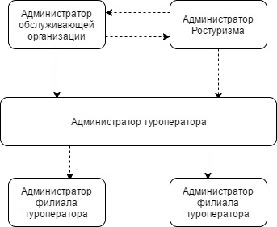
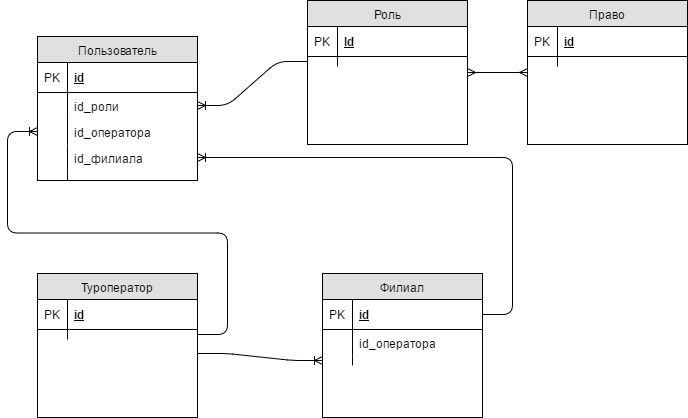

Подсистема информирования и доступа к информационным ресурсам
==============================================================

Подсистема ПОДИР предназначена для регламентированной публикации информационных ресурсов (результатов обработки данных в Системе) и предоставления сервисов по работе с ними участникам туристской деятельности (сотрудникам Ростуризма и туроператоров).

Целью создания подсистемы является реализация единого централизованного решения по предоставлению управления доступом к функциям и информационным ресурсам ИС ЭП. 

Подсистема выполняет следующие задачи:

* предоставление единообразного унифицированного пользовательского интерфейса.
* предоставление унифицированных автоматизированных рабочих мест.
* управление доступом ко всем информационным ресурсам и функциям пользовательского интерфейса.

Перечень функций реализуемых подсистемой: 

* формирование и поддержка АРМ;

* поиск информационных ресурсов;

* отображение результатов поиска информационных ресурсов; 

* сортировка результатов поиска;

* аутентификация и авторизация пользователей;

* прием обращений пользователей,

* регламентированная публикация информационных ресурсов.

Реализованная в Подсистеме операция аутентификации позволяет обеспечить доступ пользователей к информационным ресурсам Системы. В Подсистеме реализована однофакторная аутентификация. В рамках аутентификация проверяются введенные пользовательские данные (логин, пароль) на предмет их соответствия данным, содержащимся в Системе. В случае успешной аутентификации, дальнейшая обработка сессии пользователя передается операции авторизации.

Реализованная в Подсистеме операция авторизации предполагает проверку прав пользователя на доступ к запрошенному ресурсу или выполнение какой-либо операции в Системе.

В Системе предусмотрены следующие группы пользователей, обладающие различными правами:

* сотрудники Ростуризма;

* сотрудники Туроператора;

* сотрудники Финансового гаранта;

* сотрудники Филиала (подразделения) Туроператора;
туристы;

* администраторы:

* «Администратор обслуживающей организации»;

* «Администратор Ростуризма»;
* «Администратор туроператора»;
* «Администратор филиала туроператора»;
* информационные администраторы (аналитики).

       Иерархическая структура ролей

Каждый администратор родительской роли (находящейся выше по структуре) имеет право просматривать, добавлять, деактивировать, редактировать администраторов дочерних ролей (находящиеся ниже по структуре), и ролей того же уровня.

Права доступа к списку администраторов определяются путем сравнения значений полей пользователя «туроператор» и «филиал». В случае нулевых значений в данных полях система определяет, что администратор обладает ролями «Администратор обслуживающей организации» или «Администратор Ростуризма». В случае заполненного поля «туроператор» и пустого поля «филиал» система определяет, что администратор обладает ролью «Администратор туроператора». В случае не нулевых значений в полях «туроператор» и «филиал» система определяет, что администратор обладает ролью «Администратор филиала туроператора». 

       Модель данных реализации ролевой модели

Сотрудник Ростуризма обладает правами просмотра путевок, туроператоров и их филиалов, информационных ресурсов.

Сотрудник Туроператора обладает правами просмотра своих путевок, своих филиалов, информационных ресурсов. У сотрудника туроператора есть возможность создавать, редактировать путевки, созданные своим Туроператором или своим филиалом.

Сотрудник финансового гаранта имеет возможность создавать, финансовые гарантии для туроператоров и просматривать список, просматривать, удалять, редактировать созданные им гарантии.

Сотрудник филиала Туроператора обладает правами просмотра своих путевок и информационных ресурсов. У сотрудника туроператора есть возможность создавать, редактировать путевки, созданные своим филиалом.

У туриста есть возможность авторизоваться в системе по серии и номеру паспорта, а также просматривать свои путевки и информационные ресурсы. 

Информационный администратор обладает правом просмотра, создания и редактирования категорий информационных ресурсов и самих информационных ресурсов. 

У администратора с ролью «Администратор обслуживающей организации» реализованы следующие возможности:

* просматривать, добавлять, деактивировать, редактировать администраторов всех ролей. В функцию редактирования администратора входит: редактирование информации об администраторе; выбор роли администратора.

* добавлять, деактивировать, редактировать роли.  В редактирование роли входит: изменение информации о роле; выбор прав для данной роли.

* редактировать содержимое справочников;

* добавлять, удалять редактировать информационные материалы;

* добавлять, деактивировать редактировать туроператоров и их филиалы. В редактирование туроператоров входит: редактирование информации о туроператоре; добавление, удаление, редактирование филиалов данного туроператора.

У администратора с ролью «Администратор Ростуризма» реализованы следующие возможности:

* просматривать, добавлять, деактивировать, редактировать администраторов всех ролей. В функцию редактирования администратора входит:
редактирование информации об администраторе;
выбор роли администратора.

* добавлять, удалять редактировать информационные материалы;

* добавлять, деактивировать, редактировать туроператоров и их филиалы. В редактирование туроператоров входит:
редактирование информации о туроператоре;
добавление, удаление, редактирование филиалов данного туроператора.

У администратора с ролью «Администратор туроператора» реализованы следующие возможности:

* просматривать, добавлять, деактивировать, редактировать администраторов ролей «Администратор туроператора», «Администратор филиала туроператора». В функцию редактирования администратора входит: редактирование информации об администраторе;  выбор роли администратора.

* просматривать информацию о своем туроператоре и добавлять, деактивировать редактировать свои филиалы.

У администратора с ролью «Администратор филиала туроператора» реализованы следующие возможности:

* просматривать, добавлять, деактивировать, редактировать администраторов с ролью «Администратор филиала туроператора». В функцию редактирования администратора входит: редактирование информации об администраторе; выбор роли администратора.

* просматривать информацию о своем туроператоре.

Аутентификация пользователей определяется и реализовывается штатными средствами серверов приложений и соответствующих операционных систем, альтернативно - структурой каталога LDAP.

В подсистеме существует единая аутентификация зарегистрированных пользователей при обращении к данным подсистемы в течение одной пользовательской сессии.

В подсистеме обеспечена аутентификация пользователей ЕСИА при обращении к данным подсистемы в течение одной пользовательской сессии.

Любые функциональные возможности предоставляются только пользователям, прошедшим аутентификацию при условии явного разрешения на доступ к конкретному ресурсу в профиле пользователя. Исключения возможны только для ресурсов, содержащих общедоступную информацию.

При аутентификации пользователей пароли не передаются по каналам связи в открытом виде.

В случае использования приложений, поддерживающих только аутентификацию посредством пересылки открытых данных (basic authentication), проблема аутентификации решается за счет специального веб-компонента, который подменяет для пользователя систему аутентификации приложения и не допускает пересылки открытых аутентификационных данных пользователя.

Не осуществляется хранение аутентификационных параметров пользователей в открытом виде на устройствах постоянной памяти.

Система обеспечивает возможность зарегистрированному и прошедшему аутентификацию пользователю самостоятельно сменить пароль.

Функция «Прием обращений пользователей»

В Системе предусмотрена возможность по предоставлению экранных форм для заполнения и подачи обращений пользователей. 

Возможные типы обращений:

* Обращение туриста;

* Обращение туроператора по подключению его информационной системы к ИС ЭП в качестве источника информации.

Разделение по типам обращений производится в случаях различных технологий их обработки.
В экранных формах предусмотрены возможности по прикреплению файлов различных форматов: текстовых (формата .doc и объемом не более 50 кб), графических (формата .jpeg и объемом не более 2 мб), аудио (формата .mp3 и объемом не более 10 мб) и видео (в формате .mpeg4 и объемом не более 10 мб). 
Обработка обращений производиться на основе функциональных возможностей (функция регламентированной публикации данных).

