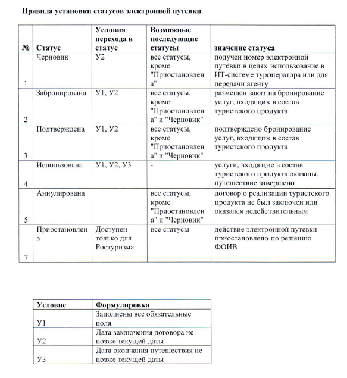
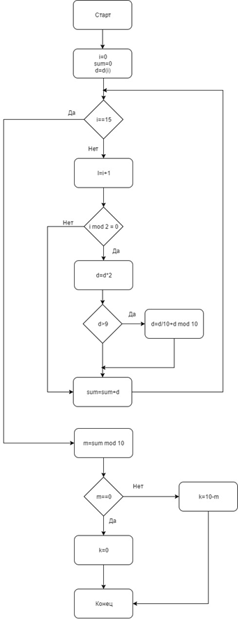

Подсистема оперативного контроля
=================================

Подсистема оперативного контроля деятельности (ПОК) участников туристского рынка предназначена для оперативного выявления признаков нарушений в деятельности участников туристского рынка, их учета и отработки в соответствии с действующими регламентами и правилами.

Подсистема реализует следующие функции ИС ЭП:

* обработка запросов туроператоров на выполнение операций с ЭП;
* оперативная проверка и определение (выявление, вскрытие) признаков нарушений в правомерности реализации туристского продукта;
* формирование уникального номера ЭП (выпуск электронной путевки) в случае отсутствия признаков нарушений в правомерности реализации туристского продукта;
* выдача предупреждений туроператору в случае окончания срока действия финансовых гарантий;
выдача предупреждений туроператору в случае снижения достаточности финансового обеспечения ниже заданных уровней;
* информирование туроператора в ответ на запрос уникального номера ЭП в случаях выявления признаков нарушений со стороны туроператора (например, недостаточность финансового обеспечения деятельности туроператора).

Состав подсистемы
************************

В состав Подсистемы входят следующие модули:

* модуль определения признаков нарушений;
* модуль формирования ЭП.

Модуль определения признаков нарушений – реализует проведение автоматических проверок в режиме реального времени и в автоматическом режиме данных о деятельности туроператора и его филиалов (подразделений). Модуль обеспечивает выявление нарушений в деятельности туроператоров.

Программный модуль определения признаков нарушения обращается к СУБД через JDBC, SQL.

Модуль формирования № ЭП - реализует механизм выпуска ЭП и изменение статусов электронной путевки, таким образом реализуя жизненный цикл ЭП.

Программный модуль формирования № ЭП - Часть основного приложения. Модуль получает от Модуля определения признаков нарушений запрос на формирование ЭП и формирует уникальный номер ЭП. Результат сохраняется в СУБД и пересылается в Модуль актуализации данных (ПС оперативной транзакционной обработки данных). Обращается к СУБД через JDBC, SQL.

Функции подсистемы
************************

В подсистеме ПОК ИС ЭП реализованы следующие функциональные возможности:

* обработка запросов туроператоров на выполнение первичных и вторичных операций с документом ЭП;

* оперативная проверка и определение (выявление, вскрытие) признаков нарушений в правомерности реализации туристского продукта;

* формирование уникального номера ЭП (выпуск электронной путевки) в случае отсутствия признаков * нарушений в правомерности реализации туристского продукта;

* выдача предупреждений туроператору в случае окончания срока действия финансовых гарантий;

* выдача предупреждений туроператору в случае снижения достаточности финансового обеспечения ниже заданных уровней;

* информирование туроператора в ответ на запрос уникального номера ЭП в случаях выявления признаков нарушений со стороны туроператора (например, недостаточность финансового обеспечения деятельности туроператора). 

Операция обработки запросов туроператоров и турагентсв
*******************************************************

К операциям обработки запросов туроператоров и турагентств относятся следующие:

* оформление электронной путевки;

* выпуск электронной путевки;

* возврат (аннулирование) электронной путевки;

* внесение изменений в электронную путевку;

* внесение изменений в статус электронной путевки;

* архивирование электронной путевки.

Возможные статусы электронной путевки:

* «забронирована» – присвоен номер ЭП, но не оплачена полностью;

* «подтверждена» – выписана полностью (оплачены и оформлены билеты, отель, страховка и т.д.);

* «использована»;

* «возвращена»;

* «черновик»;

* «аннулирована»;

* «архив».

Ниже приведена модель переход электронной путевки в возможные статусы:

Оперативные проверки и определение признаков нарушений в правомерности реализации туристского продукта
*******************************************************************************************************
Функция оперативной проверки и определение признаков нарушений в правомерности реализации туристского продукта реализована разработанным программным обеспечением.

Информирование Туроператоров должно осуществляться в разделе уведомлений (сущность notice) в личном кабинете Туроператора.

В случае если у записи данной сущности заполнены поля Status и Activity то данная запись считается нарушением и отображается в разделе «Нарушения», иначе (если данные поля пустые) запись считается предупреждением и отображается в разделе «Предупреждения».

Нарушениями деятельности туроператора являются следующие события:

* истек срок предоставления финансовых гарантий туроператора;

* туроператор пытается зарегистрировать путевку на период, по которому не предоставлены финансовые гарантии.

В случае выявления данных нарушений, для туроператора должна блокироваться возможность создания ЭП в ИС ЭП.

В случаях выявления признаков нарушений со стороны туроператора происходят уведомления:

* предоставление информации о событии с признаками нарушения в деятельности участника туристского рынка сотрудникам Ростуризма и администраторам оператора ИС ЭП;

* формирование уведомлений о событии нарушения для передачи по электронной почте (рассылка) по заранее указанным в настройках адресам.

Предупреждения Туроператору отображаются в разделе уведомлений в личном кабинете Туроператора.

У нарушений могут быть следующие статусы (notice.status):

* Подтверждено (значение 1);

* Не подтверждено (значение 0).
 

В открывшемся нарушении пользователь должен иметь возможность сменить статус нарушения (подтверждено/не подтверждено), по умолчанию должен стоять статус не подтверждено, и выбрать из выпадающего списка предпринятые меры. 

Пользователю должны быть доступны следующие меры (notice.activity): 

* Туроператору отправлено уведомление (значение 1);

* Меры не приняты. (по умолчанию значение 0).

Существует возможность контроля финансовых гарантий туроператоров на основе хранящихся исторических данных, отправляемых представителем компании финансового гаранта. Реализована форма, через которую представитель компании финансового гаранта имеет возможность отправлять данные о предоставленных финансовых гарантиях для своих туроператоров.

Порядок расчета гарантийных обязательств туроператоров
************************************************************

В ИС ЭП ведется расчет стоимости выпущенных путевок по каждому туроператору. В расчет включаются только путевки со статусом «Забронирована» или «Подтверждена» и статусом оплаты «Оплачено». За стоимость путевки берется стоимость путевки без учета агентского вознаграждения. В качестве финансовых гарантий туроператора учитываются:

* Финансовые гарантии, загруженные из ЕФРТ (поле размер финансового обеспечения);

* Фонд персональной ответственности туроператора, в случае если туроператор состоит в ассоциации «Турпомощь»

Алгоритм оперативного контроля достаточности финансового обеспечения туроператора для выпуска ЭП следующий:
 
**1.** Общая стоимость выпущенных путевок сравнивается с текущим уровнем финансового обеспечения данного туроператора.  Электронная путевка считается финансово обеспеченной при условии 
L\ :sub:`T`\> S

где

L\ :sub:`T`\ - Объём финансового обеспечения (абсолютная величина), на текущий период, равняется сумме действующих на текущий период финансовых гарантий F\ :sub:`T`\, загруженных из ЕФРТ, и фактического размера P фонда персональной ответственности туроператора. 

L\ :sub:`T`\ = F\ :sub:`T`\ + P

S - Общая стоимость выпущенных ЭП, действующих в текущий период финансовых гарантий, считаются ЭП со статусом «Подтверждена» или «Забронирована», имеющих при этом статус оплаты туроператору «Оплачена» (далее по тексту -  подлежащих учету путевок).

S= SUM (B1+B2+…+Bn) + SUM (C1+C2+…+Cn)

В - стоимость электронной путевки со статусом «Забронирована», имеющих статус оплаты туроператору «Оплачена»;

С - стоимость электронной путевки со статусом «Подтверждена», имеющих статус оплаты туроператору «Оплачена».

**2.** Если общая стоимость выпущенных путевок превышает уровень финансового обеспечения, то считается, что туроператор превысил уровень своего финансового обеспечения. В этом случае администраторам данного туроператора и сотрудникам Ростуризма отправляется уведомление о превышении уровня финансового обеспечения. Также, указанное уведомление отображается в разделе «Уведомления» веб-интерфейса ИС «Электронная путевка».
Частота и формат уведомления администраторов туроператора по электронной почте: 1 раз в день в виде отчёта с указанием:

* объёма финансового обеспечения;

* общей стоимости подлежащих учету путевок;

* размера превышения стоимости подлежащих учету путевок над объёмом финансового обеспечения (плюс или минус в зависимости от ситуации);

* размера превышения стоимости подлежащих учету путевок по внутреннему, въездному и международному туризму над объёмом финансовых гарантий FT;

* общего количества подлежащих учету путевок;

* количества подлежащих учету путевок, выпущенных за текущий день;

* суммарной стоимости подлежащих учету путевок, выпущенных за текущий день.

Частота и формат уведомления администраторов Ростуризма по электронной почте: 1 раз в день в виде отчёта по всем туроператорам, имеющим превышение уровня достаточности финансового обеспечения, с указанием для каждого туроператора:

* объёма финансового обеспечения;

* общей стоимости подлежащих учету путевок;

* размера превышения стоимости подлежащих учету путевок над объёмом финансового обеспечения;

* размера превышения стоимости подлежащих учету путевок по внутреннему, въездному и международному туризму над объёмом финансовых гарантий FT.

Формирование уникального номера ЭП
***********************************
Функция формирования уникального номера ЭП реализована с использованием алгоритма формирования уникального номера ЭП и отправки в информационную систему туроператора.

Формирование уникального номера ЭП (выпуск электронной путевки) происходит в случае отсутствия признаков нарушений в правомерности реализации туристского продукта.

Номер состоит из уникальной числовой буквенной последовательности. Уникальность номера обеспечивается средствами СУБД. Также номер ЭП дублируется в 2D код с целью обеспечения удобства его проверки туристом на портале.

Номер ЭП состоит из кода туроператора, 16 (шестнадцати) символов и контрольного числа:
хxxxxxyyyyyyyyyz,

где:

* x - реестровый номер ТО в ЕФРТ,

* y – случайное число,

* z – контрольное число по  алгоритму. 

2D код позволяет минимизировать запросы в БД, путем проверки принадлежности введенных данных к номеру ЭП непосредственно на портале. 

На рисунке  представлен алгоритм формирования контрольного числа, где i- это номер цифры из номера ЭП, d(i) – цифра из номера ЭП, k – контрольное число.

Алгоритм формирования контрольного числа состоит в следующем:

* суммируются все нечетные цифры номера ЭП;

* к нечетным цифрам суммируются четные цифры, умноженные на 2 (в случае если d(i)*2<9) или выражение d/2+d mod 10 (в случае если d(i)*2<9, где d это цифра умноженная на 2);

* полученная сумма делится 10;

* если остаток от деления равен 0, то контрольная цифра равна 0, если остаток от деления отличен от нуля, то контрольная цифра принимает значение выражения 10-m (где m – это остаток от деления полученной суммы на 10).

       Алгоритм формирования номера ЭП

Уведомления туроператоров 
***********************************

В случае окончания срока действия финансовых гарантий Туроператора, Туроператору отображается предупреждение в разделе уведомлений в личном кабинете Туроператора.
Предупреждение отображается в разделе уведомлений.

ПОК контролирует 5 уровней достаточности финансового обеспечения (в процентах от общей суммы оплат выпущенных путевок от общего размера финансовых гарантий):

* уровень 1 – 25%;

* уровень 2 – 50%;

* уровень 3 – 75%;

* уровень 4 – 90%;

* уровень 5 – 100%.

Под выпущенными понимаются путевки, находящиеся в статусах:

* забронирована – присвоен номер ЭП, но не оплачена полностью;

* приостановлена – действие путевки приостановлено;

* подтверждена – выписана полностью (оплачены и оформлены билеты, отель, страховка и т.д.).

Под общей суммой оплат выпущенных путевок понимается сумма всех платежей, поступивших в счет оплаты выпущенных ЭП.

Контроль осуществляется при любом изменении статуса ЭП или суммы платежей по ней. Информирование осуществляется при достижении более высокого уровня информирования.

Предупреждение отображается в разделе уведомлений.

В случае выявления признаков нарушений со стороны туроператора (например, недостаточность финансового обеспечения деятельности туроператора) при запросе уникального номера ЭП, Туроператору отображается уведомление в разделе уведомлений в личном кабинете Туроператора.

