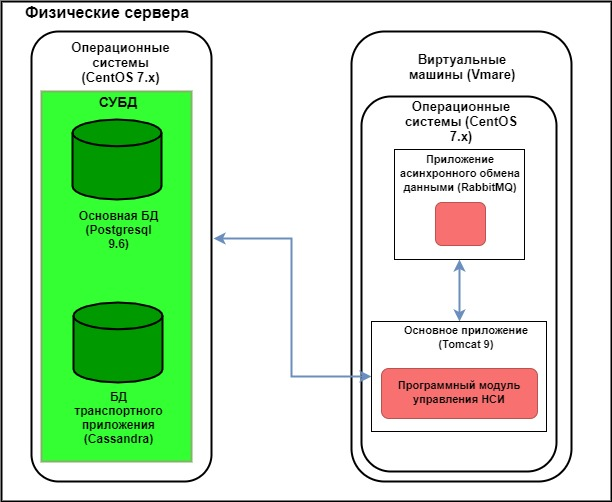

Подсистема ведения НСИ
=================================

Подсистема обеспечивает  использование информационных ресурсов ИС ЭП для распространения данных актуальных версий справочников НСИ и их актуализации, запросы на предоставление данных реализованы с помощью графического пользовательского интерфейса АРМ ИС ЭП. Структура программного обеспечения ПОНСИ и его взаимодействие с другим программным обеспечением (ПО) ИС ЭП реализована в соответствии с рисунком. 

       Структура программного обеспечения ПОНСИ и его взаимодействие с другим ПО ИС ЭП

Модуль формирует SQL запросы к ПОСХД на выборку данных справочника, указанного пользователем для отображения. После окончания процесса выборки данных модуль форматирует данные для отображения в АРМ пользователя.

После внесения изменений в выбранный пользователем справочник и получения его данных, модуль формирует SQL запрос к ПОСХД на формирование новой версии соответствующего справочника НСИ.
После внесения изменений в выбранный пользователем справочник и получения его данных, модуль формирует SQL запрос к ПОСХД на формирование новой версии классификатора НСИ.

По запросам ТО на выгрузку данных справочника, с помощью веб-сервиса, обработка которых осуществляется подсистемой ПОТОД, модуль должен сформировать SQL запрос к ПОСХД на выгрузку данных справочника, после чего упаковать их в формат XML и вернуть вызываемой подсистеме.

Примечание:

* При реализации ИС ЭП редактирование справочников реализовано только для справочников, отмеченных как редактируемые. Все эталонные справочники доступны пользователям РТ и ОС в режиме просмотра;

* Актуализация и редактирование справочника Туроператоров ЕФРТ осуществляется в подсистеме ПОТОД;

Так же модуль предназначен для реализации функции рассылки уведомлений о новых версиях справочников во все интегрированные справочники ИС туроператоров после завершения процесса создания новой версии  справочника НСИ.

Для этого, после создания новой версии справочника НСИ, модуль осуществляет формирование и рассылку по электронной почте сообщений об изменениях справочника(ов) и его(их) новых версиях зарегистрированным в системе организациям туроператоров.

Ведение справочников подразумевает внесение изменений в них и выполняется в целях актуализации данных НСИ.

Сведения о необходимости внесения изменений и соответствующие данные формируются в процессе эксплуатации Системы, на основании публикаций изменений общероссийских классификаторов и реестров, являющихся источниками данных справочников НСИ ИС ЭП, а также запросов на изменения, поступивших от ТО.

Функция позволяет автоматически выполнять:

* Предоставление данных справочников НСИ для просмотра;

* Внесение изменений в справочники НСИ путем создания их новых версий.

Ведение классификатора выполняется в целях актуализации (внесения изменений) в классификатор. 
Данные о версии структуры каждого справочника хранятся в поле классификатора, передающем хэш-функцию, формируемую алгоритмом SHA-256, которая принимает совокупность свойств справочника. Структура справочника представлена в виде JSON-файла. 

Распространение изменений в классификаторе выполняется в целях актуализации рабочей копии классификатора. 

В случае отличия данных в загружаемом классификаторе от данных в хранимом классификаторе, внешние системы имеют возможность загрузить актуальную версию справочника.  

В Системе ведется актуальная версия объектов НСИ и предоставляется возможность предоставления классификатора, содержащего данные о актуальных версиях объектов НСИ для просмотра и формирования сообщения на запрос ТО по предоставлению данных объектов НСИ.

Для доступа к функциям подсистемы используется АРМ, разработанный в виде тонкого клиента.

Распространение справочных данных выполняется в случае появления в СХД ИС ЭП новой актуальной версии какого-либо из публикуемых справочников НСИ. Функция распространения справочных данных позволяет выполнять:

* Оповещение ТО по электронной почте о создании новых версий справочников;

* Загрузку ТО классификатора ЭП с актуальной информацией о структуре справочников;

* Формирование эталонных версий справочников НСИ в формате XML по запросам от ТО.

Для успешного функционирования ИС ЭП-3, в Системе ведутся, как минимум, следующие объекты НСИ:

* Туроператоры РФ (ЕФРТ);
 
* Турагенты;

* Типы путевок;

* Виды туристических услуг;

* Статусы путевок;

* Страны;

* Города;

* Авиаперевозчики;

* Ж/Д перевозчики;

* Аэропорты;

* Ж/Д вокзалы и станции;

* Виды документа, удостоверяющего личность;

* Субъекты РФ.

Объекты НСИ перечисленные далее, реализованы в системе, но участия в функционировании ИС ЭП-3 не принимают: 

* справочник «Сферы туроператорской деятельности»;

* справочник «Статусы услуг»;

* справочник «Регионы мира»;

* справочник «Подрегионы мира»;

* справочник «Типы перевозчиков»;

* справочник «Типы способов связи»;

* справочник «Валюты».

Ведение учета турагентов выполняется в целях консолидации данных о турагентах, работающих с туроператорами. Распространение справочных данных списка турагентов выполняется в случае, когда справочные данные для внесения изменений поступают из одного источника и являются нормализованными. 

Список объектов НСИ можно скачать по ссылке приведенной ниже:

:download:`Каталог НСИ <./_static/attach/katalognsi.docx>`.

