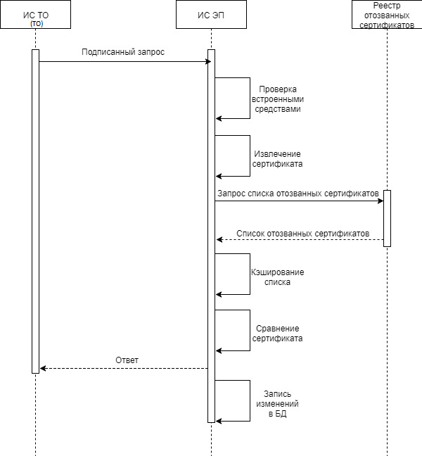

Обмен данными с удостоверяющим центром
=======================================================

В целях снижения затрат на организацию защищенного, юридически значимого электронного документооборота в ИС ЭП используются криптографические функции, связанные с созданием и проверкой электронной подписи, шифрованием и дешифрованием электронных документов. 

УЦ осуществляет свою деятельность в качестве аккредитованного УЦ на основании решения Минкомсвязи России, являющегося федеральным органом исполнительной власти, уполномоченным в сфере использования электронной подписи.

Электронная подпись создается с использованием криптографических алгоритмов в соответствии с ГОСТ Р 34.10 «Информационная технология. Криптографическая защита информации. Процессы формирования и проверки электронной цифровой подписи», ГОСТ Р 34.11-94 «Информационная технология. Криптографическая защита информации. Функция хеширования».

Данные об ЭП поступают от информационных систем ТО посредством протокола SOAP. Для подписания данных используется стандарт OASIS Standart 200401 (http://docs.oasis-open.org/wss/2004/01/oasis-200401-wss-soap-message-security-1.0.pdf). Получаемые от информационных систем ТО и подписанные заявки на создание/изменение ЭП должны быть подписаны электронной цифровой подписью (ЭЦП), а реализованное взаимодействие с УЦ позволяет обеспечить проверку и подтверждение отсутствия сертификата подписанта в реестре отозванных сертификатов УЦ. Сертификат используемой ЭЦП должен быть загружен в ИС ЭП при регистрации ИС ТО.

Заявки на самостоятельную регистрацию пользователя ТО должны быть подписаны ЭЦП, а реализованное взаимодействие с УЦ позволяет обеспечить проверку и подтверждение отсутствия сертификата подписанта в реестре отозванных сертификатов УЦ.

       Алгоритм обработки подписанных ЭЦП сообщений

ЭП получает подписанный ЭЦП запрос от ТО:

* Xml-документ – при запросе ИС ТО;
* Pdf-документ – при самостоятельной регистрации администратора ТО.

Далее ИС ЭП выполняет следующий алгоритм: 

1) ИС ЭП получает сообщение, подписанное ЭЦП;

2) Сообщение, подписанное ЭЦП, проверяется с использованием встроенных средств программной платформы (Java 1.8), реализованной в подсистеме проверки электронной подписи;

3) С помощью СКЗИ происходит извлечение сертификата из подписанного сообщения. Для сообщений ИС ТО производится валидация – совпадение извлеченного сертификата с сертификатом, соответствующим данному ТО, загруженному в систему;

4) ИС ЭП получает список отозванных сертификатов УЦ по соответствующему адресу, указанному в извлеченном из сообщения сертификате; 

5) Список кэшируется в соответствующую таблицу для того, чтобы в дальнейшем минимизировать количество обращений в УЦ (время жизни кэша реестра отозванных сертификатов – 24 часа);

6) Сертификат, полученный из сообщения ТО, проверяется на предмет отсутствия в полученном реестре; 

7) В случае успешного прохождения проверок, приложение ИС ЭП возвращает положительный ответ;

8) ИС ЭП выполняет содержащийся в сообщении запрос и сохраняет в БД исходный запрос.
