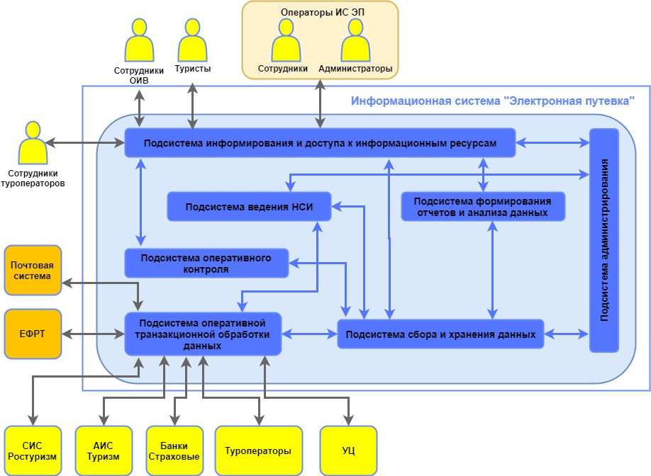

Функциональная архитектура системы
======================================

В настоящем разделе приведено описание проектных решений по Системе третьей очереди и её частям.
Функциональная структура описывается в соответствии со следующим уровнем детализации:

* Система делится на взаимосвязанные логические подсистемы;
* Подсистема - совокупность взаимосвязанных элементов Системы, выполняющая относительно самостоятельные функции, связанные с достижением целей Системы;
* в состав Подсистемы входит набор элементов-функциональных модулей, которые поддерживают различные бизнес-процессы и интегрированы между собой в масштабе реального времени;
* минимальными сущностями, которые описывают в рамках настоящего предложения логической структуры ИС ЭП являются функции, определяющие основные операции: ввода, хранения, передачи, обработки и выдачи массивов информации, входящие в состав модулей.

       Функциоанальная архитектура системы
 
Подсистемы и их описание
************************

**Подсистема сбора и хранения данных** - Подсистема предназначена:

* для наполнения актуальной информацией Хранилища данных от подсистемы оперативной транзакционной обработки данных о проданных туроператорами туристских продуктах, данных о финансовых гарантиях туроператоров и других данных;
* для хранения непротиворечивой, очищенной юридически значимой информации, необходимой для проведения оперативных проверок деятельности участников туристского рынка, формирования аналитических отчетов, интеллектуального анализа данных и прогнозирования развития туристского рынка.

**Подсистема формирования отчетов** - Подсистема предназначена для хранения и аналитической обработки данных. Обеспечивает информационную поддержку деятельности пользователей Системы, формирование и визуализацию представления информации в табличном и графическом видах, выявление практически полезных тенденций в развитии туристской деятельности, необходимых для принятия решений.
   
**Подсистема оперативного контроля** - Подсистема предназначена для оперативного выявления признаков нарушений в деятельности участников туристского рынка, их учета и отработки в соответствии с действующими регламентами и правилами.

**Подсистема ведения НСИ** - Подсистема предназначена для обработки, консолидации, а также интеграции НСИ от различных информационных систем – источников информации.

**Подсистема информирования и доступа к информационным ресурсам** - Подсистема предназначена для регламентированной публикации информационных ресурсов и предоставления сервисов по работе с ними участникам туристской деятельности (сотрудникам Ростуризма и туроператоров).

**Подсистема обеспечения информационной безопасности** - Подсистема предназначена для обеспечения комплексной защиты информационных ресурсов и средств Системы от актуальных угроз информационной безопасности, обеспечения и поддержания необходимых свойств безопасности информации, обрабатываемой Системой.

**Подсистема администрирования** - Подсистема администрирования предназначена для решения следующих задач:

* управление реестром источников и потребителей информации;
* обеспечение регистрации пользователей и управления правами доступа;
* управление централизованным журналом информационного обмена;
* мониторинга функционирования специализированного ПО.
