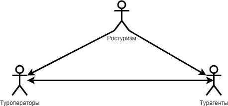
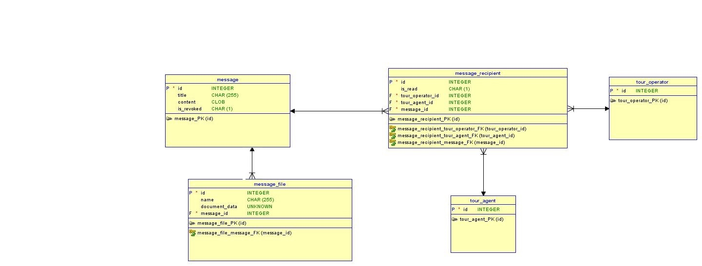

Обмен сообщениями между пользователями ИС Электронная путевка
=================================================================

В ИС ЭП существует возможность обмена сообщениями между пользователями системы. Сообщениями могут обмениваться следующие группы пользователей:

* Пользователи Ростуризма;

* Пользователи туроператора;

* Пользователи турагента. 

Ниже приведена модель обмена сообщениями между пользователями ИС ЭП, описывающая возможность отправления сообщений другим группам пользователей. Пользователи одной группы не имеют возможность отправлять сообщения друг другу.

Модель обмена сообщениями в ИС ЭП

Существует возможность отправления  сообщения нескольким пользователям. Так же существует возможность отзыва, отправленного сообщения (поле message.is_revoked)

Модель базы данных функционала обмена сообщениями
********************************************************

Сущность message - сообщение: 

* id (integer) - идентификатор;

* title (char) - заголовок сообщения;

* content (clob) - контент сообщения;

* is_revoked (logic) - True - сообщение отозвано; false - сообщение не отозвано;

Сущность message_recipient - получатели сообщения. Осуществляет возможность отправки сообщения сразу нескольким получателям. Осуществляет связь M-N между сообщениями и туроператорами, сообщениями и турагентами. 

* id (integer) - идентификатор;

* is_read (logic) - True - прочитано; False - не прочитано;

* tour_operator_id - id туроператора, которому отправлено сообщение;

* tour_agent_id -  id турагента, которому отправлено сообщение;

* message_id - id сообщения.

Сущность message_file - файл прикладываемый к сообщению.

* id (integer) - идентификатор;

* name (char) - название файла;

* document_data - данные прикладываемого файла;

* message_id - id сообщения. 

