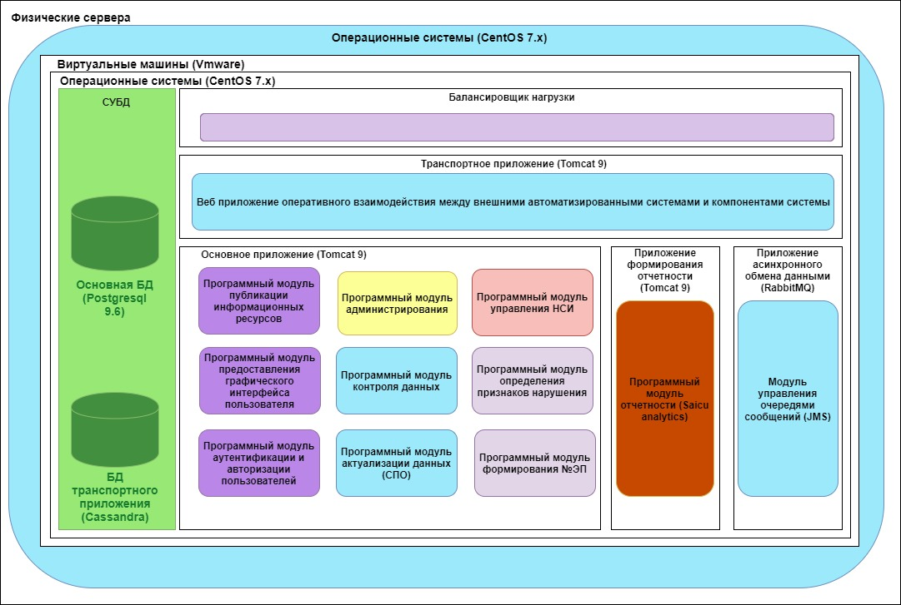
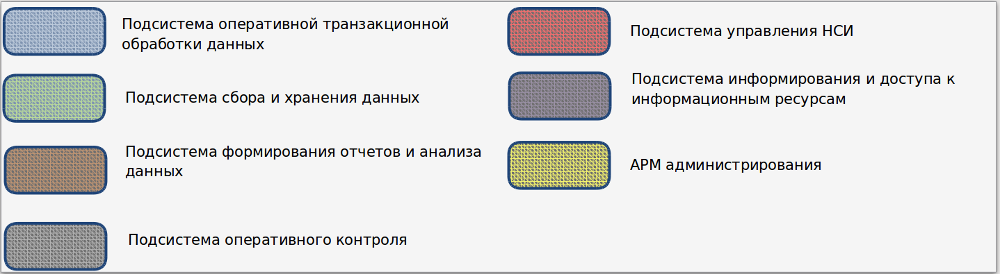

Программное обеспечение системы
===================================

При реализации проекта ИС ЭП 3-я очередь использовано ПО, структура которого представлена на рисунке.

       Структура программного обеспечения ИС ЭП третьей очереди

       Цветовое обозначение функциональных подсистем ИС ЭП

В состав программного обеспечения ИС ЭП входят:

* в качестве операционной системы используется CentOS 7;
* в качестве СУБД используется PostgresSQL 9.x.;
* в качестве веб-сервера и сервера приложений используется Apache Tomcat версия 9.0;
* веб-приложение публикации информационных ресурсов, разработанное на языке Java. Предоставляет графический инструмент для создания публикуемых ресурсов, создание соответствующих разделов и предоставляет графический пользовательский интерфейс для размещения информационных ресурсов в соответствующие разделы портала. Соответствующие инструменты автоматически оптимизируют внешний вид страницы к дизайну всего портала;
* веб‑приложение аутентификации и авторизации пользователей. Передает данные пользователей (логин, пароль) в epCoreApp, которое реализовано на языке Java и возвращает пользователю результат аутентификации/авторизации;
* веб‑приложение предоставления графического интерфейса пользователя, разработанное на языке Java с использованием фреймворка Bootstrap, реализует пользовательский интерфейс в виде АРМ в зависимости от роли пользователя в Системе.

ИС ЭП формирует следующие АРМ:
* АРМ «Администратор Ростуризма»;
* АРМ «Администратор»;
* АРМ «Сотрудник Ростуризма»;
* АРМ «Сотрудник»;
* АРМ "Финансовый гарант".

ИС ЭП предоставляет набор прав доступа к ресурсам ИС и действий над ними (просмотр, редактирование и т.д.). Позволяет создать другие АРМ с предоставлением (назначением) соответствующих прав.

Программный модуль аутентификации и авторизации пользователей – часть epCoreApp.  Позволяет обеспечить доступ пользователей к информационным ресурсам Системы. Таким образом, происходит разграничение доступа к ресурсам Системы. В рамках аутентификация проверяются введенные пользовательские данные (логин, пароль) на предмет их соответствия данным, содержащимся в БД ИС ЭП. 
Данные передаются по защищенным каналам связи. В случае успешной аутентификации, дальнейшая обработка сессии пользователя передается в авторизацию. Процедура авторизации предполагает проверку прав пользователя на доступ к запрошенному ресурсу или выполнение какой-либо операции ИС ЭП. Определенные функциональные возможности ИС ЭП предоставляются только пользователям, прошедшим аутентификацию и авторизацию при условии явного разрешения на доступ к конкретному ресурсу в профиле пользователя; Позволяет зарегистрировать нового пользователя. Также возможна авторегистрация туроператора в ИС, при условии, что он присутствует в ЕФРТ.

Программный модуль управления НСИ реализует логику управления НСИ	и предоставляет доступ к различным справочникам.

Программный модуль формирования электронной путевки - часть epCoreApp. Модуль получает запрос на формирование ЭП и формирует уникальный номер ЭП. Результат сохраняется в СУБД.

Программный модуль актуализации данных осуществляет чтение реестров, поиск и предоставляет для просмотра пользователю ИС, согласно имеющимся правам.

Программный модуль контроля данных предназначен для контроля непротиворечивости форматов, принимаемых данных с целью их дальнейшей обработки. В случае различия форматов полей данных выдается соответствующая ошибка. Также определяет, заполнены ли все соответствующие поля в получаемых данных. В случае пустых полей, обязательных для заполнения (например, страна прилета, номер документа, фамилия и имя туриста и др.), внешней системе отправляется соответствующая ошибка.
Программный модуль отчетности формирует запросы к ПОСХД и визуализирует результаты исполнения запросов. 

Описание программного обеспечения основного приложения системы (Core application) вы можете скачать по ссылке:

:download:`Описание Core application <./_static/attach/appcore.docx>`.

Описание программного обеспечения транспортного приложения системы (Transport application) вы можете скачать по ссылке:

:download:`Описание Transport application <./_static/attach/apptransport.docx>`.

Балансировка нагрузки в ИС ЭП
******************************

В целевой ИС ЭП предусмотрена балансировки нагрузки на прикладном уровне, для чего применяется балансировщик nginx, который работает в режиме «умного» прокси-сервера. Он анализирует клиентские запросы и перенаправляет их на разные серверы в зависимости от загруженности сервера.

Операционная система
*********************

Операционная система — комплекс взаимосвязанных программ, предназначенных для управления ресурсами вычислительного устройства и организации взаимодействия с пользователем.
В функции операционной системы входят:

1) основные функции:

* исполнение запросов программ (ввод и вывод данных, запуск и остановка других программ, выделение и освобождение дополнительной памяти и др.);

* загрузка программ в оперативную память и их выполнение;

* стандартизованный доступ к периферийным устройствам (устройства ввода-вывода);

* управление оперативной памятью (распределение между процессами, организация виртуальной памяти);

* управление доступом к данным на энергонезависимых носителях (таких как жёсткий диск, оптические диски и др.), организованным в той или иной файловой системе;

* обеспечение пользовательского интерфейса;

* сохранение информации об ошибках системы.

2) дополнительные функции:

* параллельное или псевдопараллельное выполнение задач (многозадачность);

* эффективное распределение ресурсов вычислительной системы между процессами;

* разграничение доступа различных процессов к ресурсам;

* организация надёжных вычислений (невозможности одного вычислительного процесса намеренно или по ошибке повлиять на вычисления в другом процессе), основана на разграничении доступа к ресурсам;
взаимодействие между процессами: обмен данными, взаимная синхронизация;

* защита самой системы, а также пользовательских данных и программ от действий пользователей (злонамеренных или по незнанию) или приложений;

* многопользовательский режим работы и разграничение прав доступа.

Для работы ИС ЭП применяется Unix подобная операционная система CentOS 7.x.

Unix– это семейство переносимых, многозадачных и многопользовательских операционных систем. Каждый из пользователей системы может выполнять множество различных вычислительных процессов, которые будут использовать ресурсы именно этого компьютера. Ядро системы написано таким образом, что его легко можно приспособить практически под любой микропроцессор, а не только под популярное семейство i-386 (i-686).

Сервер приложений
*********************

Сервер приложений (англ. application server) — программная платформа, предназначенная для эффективного исполнения процедур (программ, механических операций, скриптов), которые поддерживают построение приложений. Сервер приложений действует как набор компонентов, доступных разработчику программного обеспечения через API (Интерфейс прикладного программирования), который определен самой платформой.

Современные серверы приложений нацелены на то, чтобы выполнять такие сервисы, как кластеризация, отказоустойчивость и балансировка нагрузки, позволяя таким образом разработчикам сфокусироваться только на реализации бизнес-логики.

Для реализации контейнера сервлетов в ИС ЭП используется Apache TomCat.

СУБД ИС ЭП
***********

Система управления базами данных (СУБД) — совокупность программных и лингвистических средств общего или специального назначения, обеспечивающих управление созданием и использованием баз данных.

В качестве СУБД в ИС ЭП используется Postgresql 9.6. Предложенная версия СУБД расширяет функциональные возможности ИС ЭП и позволяет наряду с коммерческими СУБД (Oracle) использовать свободно распространяемые версии СУБД. Это позволяет существенно снизить расходы на эксплуатацию ИС ЭП за счет исключения ежегодных платежей за техническую поддержку СУБД.

Инструкция по развертыванию системы
************************************

Инструкцию по развертыванию системы вы можете скачать по ссылке, приведенной ниже:

:download:`Инструкция по развертыванию системы <./_static/attach/nkppo.docx>`.

