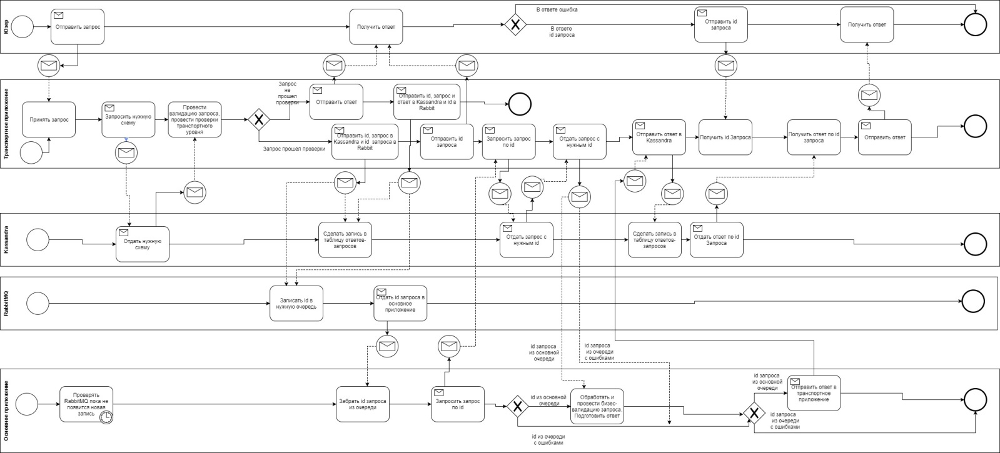

Обмен данными с ИС туроператоров, турагентов и финансовых гарантов
=======================================================================

В качестве технологии информационного обмена используются web-службы стиля document/literal. Стороны взаимодействуют, обмениваясь SOAP-сообщениями. SOAP‑сообщения должны удовлетворять требованиям спецификации на SOAP версии 1.2 и состоять из двух частей.

Описание всех операций, их входных и выходных параметров, а также возможных исключений приводится в WSDL-документах, удовлетворяющих спецификации WSDL версии 2.0.

Используя WSDL-описание, разработчики прикладных программных средств самостоятельно реализуют клиентскую часть программного обеспечения.

Вся передаваемая информация об ЭП должна соответствовать формату и структуре, описанной в приложенных руководствах.

В целях обеспечения информационной безопасности канала связи между туроператором (филиалом туроператора) и ИС ЭП третьей очереди доступ ИС туроператора к ИС ЭП осуществляется по https с использованием шифрования канала по алгоритму ГОСТ 28147-89.

       Алгоритм работы веб-службы

Ниже приведены ссылки для скачивания руководств по интеграции внешних систем туроператоров, турагентов и финансовых гарантов с ИС Электронная путевка.

:download:`Руководство по API-шлюзу актуализации НСИ <./_static/attach/apinsi.docx>`.

:download:`Руководство по API-шлюзу передачи информации электронной путевки <./_static/attach/apiep.docx>`.

:download:`Руководство по API-шлюзу получения состава и структуры НСИ <./_static/attach/apiclass.docx>`.

:download:`Руководство по API-шлюзу формирования номера электронной путевки <./_static/attach/apinumber.docx>`.

:download:`Руководство по API-шлюзу передачи информации турагентов <./_static/attach/apitouragent.docx>`.

:download:`Руководство по API-шлюзу передачи информации турагентов <./_static/attach/apitouragent.docx>`.

:download:`Руководство по API-шлюзу заугрузки электронных путевок <./_static/attach/apivoucherdownload.docx>`.

:download:`Руководство по API-шлюзу заугрузки электронных путевок <./_static/attach/fin.docx>`.

